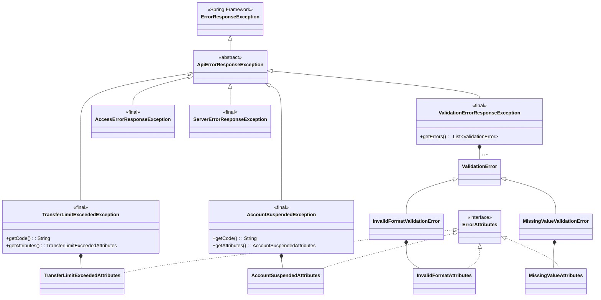

# Smithy API errors

## Context
We want to define how our API errors are defined in Smithy. Errors in Smithy are defined as follows:
```
@error("client")
@httpError(429)
structure ThrottlingError {
    @required
    message: String
}
```

Then in the operation definition, we can associate errors to given operations:
```
// List all users
@readonly
@http(method: "GET", uri: "/users")
operation ListUsers {
    output := {
        @required
        users: UserList
    }

    errors: [
        ThrottlingError
    ]
}
```

This will allow us to link errors and API endpoints to provide great OpenAPI Documentation as well as generate service/client side code to handle these errors gracefully.

## Smithy structure
Our custom implementation for Wise follows this structure. We have different types of errors Access, Service, Domain and Validation errors. These can be extended with more specific errors.

- Access error: Unauthorized, unauthenticated, rate limited...
- Service errors: Oops, something went wrong (500)
- Validation errors: When we validate payloads and we are missing information and is not correctly formatted.
- Domain errors: Business logic validations and checks such as an account being suspended.

For more information about our errors visit repository: https://github.com/transferwise/wise-api-contracts/tree/main/wise-api-contracts-errors

We are implementing the RFC-9457: https://www.rfc-editor.org/rfc/rfc9457.html to structure our errors. The basic problem detail structure is:
### Custom traits
We need few custom traits mainly to improve our OpenAPI documentation. This will probably help us as well to generate the Java classes to support inheritance and constant values.

#### Error type const
These traits are accessError, serviceError, validationError and domainError. They will be defined:
```
// --------- Access Error ---------
@trait
structure accessError {}

// --------- Service Error ---------
@trait
structure serviceError {}

// --------- Validation Error ---------
@trait
structure validationError {}

// --------- Domain Error ---------
@trait
structure domainError {}
```

These traits are going to help us determine to which "category" each specific error belongs.

#### Const (constant values)
Trait that is applicable to members of a structure to indicate it is a constant value. It will be transformed into a static value in Java. This is NOT a default but a specific immutable value
```
@const("/errors/types/domain")
@required
type: String
```

#### MemberExamples (examples)
This trait help us generate better openAPI specs where we can provide example for given fields. This won't have an impact in the java generated code (maybe javadoc if we want to generate examples).
```
@memberExample("/api/v1/users")
instance: String
```
### Error structure
The error structure follows a flat hierarchy with a single level of inheritance from `ApiErrorResponseException`:




```
// --------- Problem Detail (base class) ---------
@mixin
structure ProblemDetailMixin {
    @required
    type: String

    @required
    title: String

    @required
    status: Integer

    detail: String

    instance: String
}
```
### Access errors structure
[TBD] - Should follow a very similar structure to domain errors

### Server errors structure
[TBD] - Should follow a very similar structure to domain errors

### Domain errors structure
The domain errors schema:

```
// --------- Domain Error ---------
@trait
structure domainError {}

@mixin
@domainError
structure DomainProblemDetailMixin with [ProblemDetailMixin] {
    @const("/errors/types/domain")
    @required
    type: String

    @required
    code: String
}
```

Specific example:
```
// ------------ TransferLimitExceeded Domain Error ------------
structure TransferLimitAttributes {
    @memberExample(15000.00)
    @required
    amount: BigDecimal

    @memberExample("USD")
    @required
    currency: String
}

@error("client")
@httpError(422)
structure TransferLimitExceededDomainProblemDetail with [DomainProblemDetailMixin] {
    @const("Transfer Limit Exceeded")
    @required
    title: String

    @const(422)
    @required
    status: Integer

    @const("TRANSFER_LIMIT_EXCEEDED")
    @required
    code: String

    @required
    attributes: TransferLimitAttributes
}
```

### Validation errors structure
Validation errors are slightly different because we can return a list of errors. We are not documenting every single error in every endpoint since it could be very noisy so we are having a generic example with all the possible schemas on every endpoint (ValidationProblemDetail). Then we will have all the possible ValidationDetail implementations defined

```
// --------- Validation Error ---------
@trait
structure validationError {}

@mixin
@validationError
structure ValidationProblemDetailMixin with [ProblemDetailMixin] {
    @const("/errors/types/validation")
    @required
    type: String

    @const("Validation Problem")
    @required
    title: String

    @const(400)
    @required
    status: Integer

    @memberExample("Validation failed")
    detail: String

    @memberExample("/api/v1/users")
    instance: String

    @required
    errors: ValidationErrorDetailUnionList
}

@mixin
structure ValidationErrorDetailMixin {
    @required
    @memberExample("Validation error detail")
    detail: String

    @required
    @const("validation_error_code")
    code: String

    @required
    @memberExample("field")
    ref: String
}

list ValidationErrorDetailUnionList {
    member: ValidationErrorDetailUnion
}

union ValidationErrorDetailUnion {
    missingValueValidationErrorDetail: MissingValueValidationErrorDetail
    invalidFormatValidationErrorDetail: InvalidFormatValidationErrorDetail
}

structure MissingValueValidationErrorDetail with [ValidationErrorDetailMixin] {}

structure InvalidFormatValidationErrorDetail with [ValidationErrorDetailMixin] {}

@error("client")
@httpError(400)
structure ValidationProblemDetail with [ValidationProblemDetailMixin] {
    @memberExample([
        {
            missingValueValidationErrorDetail: { code: "missing_value", detail: "Name is required", ref: "name" }
        },
        {
            invalidFormatValidationDetail: {
                code: "invalid_format",
                detail: "Email must be a valid email address",
                ref: "email",
                attributes: { pattern: "^[a-zA-Z0-9]+$" }
            }
        }
    ])
    @required
    errors: ValidationErrorDetailUnionList
}
```

Json example for Validation Error:
```
{
    "type": "/errors/types/validation",
    "title": "Validation Problem",
    "status": 422,
    "detail": "Validation error detail",
    "instance": "/api/v1/users",
    "errors": [
        {
            code: "invalid_format"
            detail: "Email must be a valid email address"
            ref: "email"
            attributes: {
                pattern: "^[a-zA-Z0-9]+$"
            }
        },
        {
            code: "missing_value",
            detail: "Name is required",
            ref: "name"
        }
    ]
}
```

Specific validation error details would look like this:
```
// ------------ InvalidFormat Validation Error ------------
structure InvalidFormatAttributes {
    @memberExample("^[a-zA-Z0-9]+$")
    @required
    pattern: String
}

structure InvalidFormatValidationErrorDetail with [ValidationErrorDetailMixin] {
    @const("invalid_format")
    @required
    code: String

    @memberExample("Email must be a valid email address")
    @required
    detail: String

    @memberExample("email")
    @required
    ref: String

    attributes: InvalidFormatAttributes
}
```

### Improvements
- We have NOT put too much thoughts on validation and making sure these traits throw errors to warn devs they are doing something we shouldn't
    - Adding a const with the wrong simpleType (string instead of int)
    - Adding an example that doesn't match the schema

## Codegen: Java Spring-boot implementation
Now the juicy bits, the specific SpringBoot implementation for these errors! We follow a simplified flat hierarchy where each exception extends directly from `ApiErrorResponseException` and builds its own `ProblemDetail`.

### Design Principles

1. **Flat Hierarchy**: Only 2 levels of inheritance (Spring's `ErrorResponseException` -> `ApiErrorResponseException` -> concrete exceptions)
2. **Self-Contained**: Each exception builds its own `ProblemDetail` internally
3. **Type Safety**: Domain exceptions use typed attributes records
4. **Immutability**: Exceptions are immutable, built via builders
5. **RFC 7807 Compliant**: All responses follow the Problem Details specification

### Base Classes

An abstract class (ApiErrorResponseException) will help us identify our errors vs spring errors (ErrorResponseException):
```java
public abstract class ApiErrorResponseException extends ErrorResponseException {

  protected ApiErrorResponseException(ProblemDetail problemDetail) {
    super(HttpStatusCode.valueOf(problemDetail.getStatus()), problemDetail, null);
  }

  protected ApiErrorResponseException(ProblemDetail problemDetail, Throwable cause) {
    super(HttpStatusCode.valueOf(problemDetail.getStatus()), problemDetail, cause);
  }
}
```

We are also going to define an "Attributes" interface to make working with error attributes more generic:
```java
public interface ErrorAttributes {

}
```

We also define a base interface for all error codes:
```java
public interface ErrorCode {

  String getCode();
}
```

### Domain Errors
Domain exceptions extend `ApiErrorResponseException` directly and build their own `ProblemDetail`. Each exception has a fixed type, title, status, and code, with configurable detail and type-safe attributes.

We use enums for domain error codes that follow a domain.error_code pattern:
```java
public interface DomainErrorCode extends ErrorCode {

  String getDomain();

  String getErrorCode();
}
```

```java
public enum TransferErrorCode implements DomainErrorCode {

  TRANSFER_LIMIT_EXCEEDED("transfer_limit_exceeded");

  private static final String DOMAIN = "transfer";

  private final String errorCode;
  private final String code;

  TransferErrorCode(String errorCode) {
    this.errorCode = errorCode;
    this.code = DOMAIN + "." + errorCode;
  }

  @Override
  public String getDomain() {
    return DOMAIN;
  }

  @Override
  public String getErrorCode() {
    return errorCode;
  }

  @Override
  public String getCode() {
    return code;
  }

  @Override
  public String toString() {
    return code;
  }
}
```

The specific domain exception implementation:
```java
public final class TransferLimitExceededException extends ApiErrorResponseException {

  private static final URI TYPE = URI.create("/errors/types/domain");
  private static final TransferErrorCode CODE = TransferErrorCode.TRANSFER_LIMIT_EXCEEDED;
  private static final String TITLE = "Transfer Limit Exceeded";
  private static final HttpStatus DEFAULT_STATUS = HttpStatus.UNPROCESSABLE_CONTENT;
  private static final String CODE_PROPERTY = "code";
  private static final String ATTRIBUTES_PROPERTY = "attributes";

  private TransferLimitExceededException(ProblemDetail problemDetail, Throwable cause) {
    super(problemDetail, cause);
  }

  public static Builder builder() {
    return new Builder();
  }

  public String getCode() {
    return CODE.getCode();
  }

  public TransferLimitExceededAttributes getAttributes() {
    return Optional.ofNullable(getBody().getProperties())
        .map(props -> (TransferLimitExceededAttributes) props.get(ATTRIBUTES_PROPERTY))
        .orElse(null);
  }

  private static ProblemDetail buildProblemDetail(String detail,
      TransferLimitExceededAttributes attributes) {
    ProblemDetail problemDetail = ProblemDetail.forStatus(DEFAULT_STATUS);
    problemDetail.setType(TYPE);
    problemDetail.setTitle(TITLE);
    if (detail != null) {
      problemDetail.setDetail(detail);
    }
    problemDetail.setProperty(CODE_PROPERTY, CODE.getCode());
    problemDetail.setProperty(ATTRIBUTES_PROPERTY, attributes);
    return problemDetail;
  }

  public static final class Builder {

    private String detail;
    private TransferLimitExceededAttributes attributes;

    private Builder() {
    }

    public Builder detail(String detail) {
      this.detail = detail;
      return this;
    }

    public Builder attributes(TransferLimitExceededAttributes attributes) {
      this.attributes = attributes;
      return this;
    }

    public TransferLimitExceededException build() {
      Objects.requireNonNull(attributes, "attributes is required");
      return new TransferLimitExceededException(buildProblemDetail(detail, attributes), null);
    }
  }
}
```

And the type-safe attributes record:
```java
public record TransferLimitExceededAttributes(BigDecimal amount, String currency) implements
    ErrorAttributes {

  public static Builder builder() {
    return new Builder();
  }

  public static final class Builder {

    private BigDecimal amount;
    private String currency;

    private Builder() {
    }

    public Builder amount(BigDecimal amount) {
      this.amount = amount;
      return this;
    }

    public Builder currency(String currency) {
      this.currency = currency;
      return this;
    }

    public TransferLimitExceededAttributes build() {
      return new TransferLimitExceededAttributes(amount, currency);
    }
  }
}
```

Usage example:
```java
throw TransferLimitExceededException.builder()
    .detail("Your transfer exceeds the daily limit")
    .attributes(TransferLimitExceededAttributes.builder()
        .amount(new BigDecimal("15000.00"))
        .currency("USD")
        .build())
    .build();

// JSON Response:
// {
//   "type": "/errors/types/domain",
//   "title": "Transfer Limit Exceeded",
//   "status": 422,
//   "detail": "Your transfer exceeds the daily limit",
//   "code": "transfer.transfer_limit_exceeded",
//   "attributes": {
//     "amount": 15000.00,
//     "currency": "USD"
//   }
// }
```

### Validation Errors
Validation errors contain a list of error details rather than specific exceptions for each type:

```java
public final class ValidationErrorResponseException extends ApiErrorResponseException {

  private static final URI TYPE = URI.create("/errors/types/validation");
  private static final String TITLE = "Validation Problem";
  private static final HttpStatus STATUS = HttpStatus.BAD_REQUEST;
  private static final String ERRORS_PROPERTY = "errors";

  private ValidationErrorResponseException(ProblemDetail problemDetail, Throwable cause) {
    super(problemDetail, cause);
  }

  public static Builder builder() {
    return new Builder();
  }

  @SuppressWarnings("unchecked")
  public List<ValidationError> getErrors() {
    return Optional.ofNullable(getBody().getProperties())
        .map(props -> (List<ValidationError>) props.get(ERRORS_PROPERTY))
        .orElse(Collections.emptyList());
  }

  private static ProblemDetail buildProblemDetail(List<ValidationError> errors) {
    ProblemDetail problemDetail = ProblemDetail.forStatus(STATUS);
    problemDetail.setType(TYPE);
    problemDetail.setTitle(TITLE);
    problemDetail.setProperty(ERRORS_PROPERTY, new ArrayList<>(errors));
    return problemDetail;
  }

  public static final class Builder {

    private final List<ValidationError> errors = new ArrayList<>();

    private Builder() {
    }

    public Builder error(ValidationError error) {
      this.errors.add(error);
      return this;
    }

    public Builder errors(List<? extends ValidationError> errors) {
      this.errors.addAll(errors);
      return this;
    }

    public ValidationErrorResponseException build() {
      return new ValidationErrorResponseException(buildProblemDetail(errors), null);
    }
  }
}
```

The ValidationError class allows working with multiple types of validation errors:
```java
@JsonTypeInfo(use = JsonTypeInfo.Id.NAME, property = "code")
@JsonSubTypes({
    @JsonSubTypes.Type(value = InvalidFormatValidationError.class, name = "invalid_format"),
    @JsonSubTypes.Type(value = MissingValueValidationError.class, name = "missing_value")
})
public abstract sealed class ValidationError
    permits InvalidFormatValidationError, MissingValueValidationError {

  private final String code;
  private final String detail;
  private final String ref;
  private final ErrorAttributes attributes;

  protected ValidationError(String code, String detail, String ref, ErrorAttributes attributes) {
    this.code = code;
    this.detail = detail;
    this.ref = ref;
    this.attributes = attributes;
  }

  public String getCode() {
    return code;
  }

  public String getDetail() {
    return detail;
  }

  public String getRef() {
    return ref;
  }

  public ErrorAttributes getAttributes() {
    return attributes;
  }

  public abstract static class Builder<A extends ErrorAttributes, T extends ValidationError> {

    protected String detail;
    protected String ref;
    protected A attributes;

    protected Builder() {
    }

    public Builder<A, T> detail(String detail) {
      this.detail = detail;
      return this;
    }

    public Builder<A, T> ref(String ref) {
      this.ref = ref;
      return this;
    }

    public Builder<A, T> attributes(A attributes) {
      this.attributes = attributes;
      return this;
    }

    public abstract T build();
  }
}
```

We also define an enum for validation error codes:
```java
public enum ValidationErrorCode implements ErrorCode {

  MISSING_VALUE("missing_value"),
  INVALID_FORMAT("invalid_format");

  private final String code;

  ValidationErrorCode(String code) {
    this.code = code;
  }

  @Override
  public String getCode() {
    return code;
  }

  @Override
  public String toString() {
    return code;
  }
}
```

And the specific implementation for the errors and their error attributes:
```java
public final class InvalidFormatValidationError extends ValidationError {

  private static final ValidationErrorCode CODE = ValidationErrorCode.INVALID_FORMAT;

  @JsonCreator
  private InvalidFormatValidationError(
      @JsonProperty("detail") String detail,
      @JsonProperty("ref") String ref,
      @JsonProperty("attributes") InvalidFormatAttributes attributes) {
    super(CODE.getCode(), detail, ref, attributes);
  }

  public static Builder builder() {
    return new Builder();
  }

  @Override
  public InvalidFormatAttributes getAttributes() {
    return (InvalidFormatAttributes) super.getAttributes();
  }

  public static final class Builder
      extends ValidationError.Builder<InvalidFormatAttributes, InvalidFormatValidationError> {

    private Builder() {
    }

    @Override
    public InvalidFormatValidationError build() {
      return new InvalidFormatValidationError(detail, ref, attributes);
    }
  }
}
```

Type-safe attributes for invalid format errors:
```java
public record InvalidFormatAttributes(String pattern) implements ErrorAttributes {

  public static Builder builder() {
    return new Builder();
  }

  public static final class Builder {

    private String pattern;

    private Builder() {
    }

    public Builder pattern(String pattern) {
      this.pattern = pattern;
      return this;
    }

    public InvalidFormatAttributes build() {
      return new InvalidFormatAttributes(pattern);
    }
  }
}
```

Usage example:
```java
throw ValidationErrorResponseException.builder()
    .error(InvalidFormatValidationError.builder()
        .detail("Email format is invalid")
        .ref("user.email")
        .attributes(InvalidFormatAttributes.builder()
            .pattern("^[\\w.-]+@[\\w.-]+\\.\\w+$")
            .build())
        .build())
    .error(MissingValueValidationError.builder()
        .detail("First name is required")
        .ref("user.firstName")
        .attributes(MissingValueAttributes.builder()
            .missingField("firstName")
            .build())
        .build())
    .build();

// JSON Response:
// {
//   "type": "/errors/types/validation",
//   "title": "Validation Problem",
//   "status": 400,
//   "errors": [
//     {
//       "code": "invalid_format",
//       "detail": "Email format is invalid",
//       "ref": "user.email",
//       "attributes": { "pattern": "^[\\w.-]+@[\\w.-]+\\.\\w+$" }
//     },
//     {
//       "code": "missing_value",
//       "detail": "First name is required",
//       "ref": "user.firstName",
//       "attributes": { "missingField": "firstName" }
//     }
//   ]
// }
```

### Access Errors
Access errors handle authentication and authorization failures:

```java
public final class AccessErrorResponseException extends ApiErrorResponseException {

  private static final URI TYPE = URI.create("/errors/types/access");
  private static final HttpStatus DEFAULT_STATUS = HttpStatus.UNAUTHORIZED;

  private AccessErrorResponseException(ProblemDetail problemDetail, Throwable cause) {
    super(problemDetail, cause);
  }

  public static Builder builder() {
    return new Builder();
  }

  private static ProblemDetail buildProblemDetail(String title, String detail) {
    ProblemDetail problemDetail = ProblemDetail.forStatus(DEFAULT_STATUS);
    problemDetail.setType(TYPE);
    problemDetail.setTitle(title);
    if (detail != null) {
      problemDetail.setDetail(detail);
    }
    return problemDetail;
  }

  public static final class Builder {

    private String title;
    private String detail;

    private Builder() {
    }

    public Builder title(String title) {
      this.title = title;
      return this;
    }

    public Builder detail(String detail) {
      this.detail = detail;
      return this;
    }

    public AccessErrorResponseException build() {
      return new AccessErrorResponseException(buildProblemDetail(title, detail), null);
    }
  }
}
```

Usage example:
```java
throw AccessErrorResponseException.builder()
    .title("Unauthorized")
    .detail("Invalid or expired token")
    .build();

// JSON Response:
// {
//   "type": "/errors/types/access",
//   "title": "Unauthorized",
//   "status": 401,
//   "detail": "Invalid or expired token"
// }
```

### Server Errors
Server errors handle internal server failures:

```java
public final class ServerErrorResponseException extends ApiErrorResponseException {

  private static final URI TYPE = URI.create("/errors/types/server");
  private static final HttpStatus DEFAULT_STATUS = HttpStatus.INTERNAL_SERVER_ERROR;

  private ServerErrorResponseException(ProblemDetail problemDetail, Throwable cause) {
    super(problemDetail, cause);
  }

  public static Builder builder() {
    return new Builder();
  }

  private static ProblemDetail buildProblemDetail(String title, String detail) {
    ProblemDetail problemDetail = ProblemDetail.forStatus(DEFAULT_STATUS);
    problemDetail.setType(TYPE);
    problemDetail.setTitle(title);
    if (detail != null) {
      problemDetail.setDetail(detail);
    }
    return problemDetail;
  }

  public static final class Builder {

    private String title;
    private String detail;

    private Builder() {
    }

    public Builder title(String title) {
      this.title = title;
      return this;
    }

    public Builder detail(String detail) {
      this.detail = detail;
      return this;
    }

    public ServerErrorResponseException build() {
      return new ServerErrorResponseException(buildProblemDetail(title, detail), null);
    }
  }
}
```

Usage example:
```java
throw ServerErrorResponseException.builder()
    .title("Internal Server Error")
    .detail("Database connection failed")
    .build();

// JSON Response:
// {
//   "type": "/errors/types/server",
//   "title": "Internal Server Error",
//   "status": 500,
//   "detail": "Database connection failed"
// }
```

### File Structure
```
exception/
├── ApiErrorResponseException.java       # Base class
├── ErrorAttributes.java                 # Marker interface
├── ErrorCode.java                       # Error code interface
├── access/
│   └── AccessErrorResponseException.java
├── domain/
│   ├── AccountErrorCode.java
│   ├── AccountSuspendedAttributes.java
│   ├── AccountSuspendedException.java
│   ├── DomainErrorCode.java
│   ├── TransferErrorCode.java
│   ├── TransferLimitExceededAttributes.java
│   └── TransferLimitExceededException.java
├── server/
│   └── ServerErrorResponseException.java
└── validation/
    ├── InvalidFormatAttributes.java
    ├── InvalidFormatValidationError.java
    ├── MissingValueAttributes.java
    ├── MissingValueValidationError.java
    ├── ValidationError.java
    ├── ValidationErrorCode.java
    └── ValidationErrorResponseException.java
```

### Summary

| Aspect | Value |
|--------|-------|
| Hierarchy depth | 2 levels |
| Exception classes | 5 |
| ProblemDetail classes | 0 (built internally) |
| Code complexity | Low |
| Exception creation | Single-step builder |

### Improvements
This is a proposal, we would appreciate any simplification possible but our aim is to have an extensible solution and also allow us to be very specific when handling these events on the client side (future SDK).

Error codes have been abstracted using enums implementing the `ErrorCode` interface. Domain errors use `DomainErrorCode` which provides a domain prefix pattern (e.g., `transfer.transfer_limit_exceeded`), while validation errors use `ValidationErrorCode` for simpler codes (e.g., `invalid_format`, `missing_value`).

The builder pattern has been adopted throughout for a fluent and type-safe API. Domain exception builders enforce mandatory attributes at build time using `Objects.requireNonNull()`.

We implemented some tests to validate Jackson serialization and deserialization for these so the code should be fairly usable. Using this context with an LLM will probably give us a good head start if agreed upon the proposed solution.
