# Smithy API errors

## Context
We want to define how our API errors are defined in Smithy. Errors in Smithy are defined as follows:
```
@error("client")
@httpError(429)
structure ThrottlingError {
    @required
    message: String
}
```

Then in the operation definition, we can associate errors to given operations:
```
// List all users
@readonly
@http(method: "GET", uri: "/users")
operation ListUsers {
    output := {
        @required
        users: UserList
    }

    errors: [
        ThrottlingError
    ]
}
```

This will allow us to link errors and API endpoints to provide great OpenAPI Documentation as well as generate service/client side code to handle these errors gracefully.

## Smithy structure
Our custom implementation for Wise follows this structure. We have different types of errors Access, Service, Domain and Validation errors. These can be extended with more specific errors.

- Access error: Unauthorized, unauthenticated, rate limited...
- Service errors: Oops, something went wrong (500)
- Validation errors: When we validate payloads and we are missing information and is not correctly formatted.
- Domain errors: Business logic validations and checks such as an account being suspended.

For more information about our errors visit repository: https://github.com/transferwise/wise-api-contracts/tree/main/wise-api-contracts-errors

We are implementing the RFC-9457: https://www.rfc-editor.org/rfc/rfc9457.html to structure our errors. The basic problem detail structure is:
### Custom traits
We need few custom traits mainly to improve our OpenAPI documentation. This will probably help us as well to generate the Java classes to support inheritance and constant values.

#### Error type const
These traits are accessError, serviceError, validationError and domainError. They will be defined:
```
// --------- Access Error ---------
@trait
structure accessError {}

// --------- Service Error ---------
@trait
structure serviceError {}

// --------- Validation Error ---------
@trait
structure validationError {}

// --------- Domain Error ---------
@trait
structure domainError {}
```

These traits are going to help us determine to which "category" each specific error belongs.

#### Const (constant values)
Trait that is applicable to members of a structure to indicate it is a constant value. It will be transformed into a static value in Java. This is NOT a default but a specific immutable value
```
@const("/errors/types/domain")
@required
type: String
```

#### MemberExamples (examples)
This trait help us generate better openAPI specs where we can provide example for given fields. This won't have an impact in the java generated code (maybe javadoc if we want to generate examples).
```
@memberExample("/api/v1/users")
instance: String
```
### Error structure
The error structure is organized in two layers with internal/public visibility:

```mermaid
classDiagram
    class ApiErrorResponseException {
        <<abstract>>
    }

    class AccessErrorResponseException {
        <<sealed>>
    }
    class ServerErrorResponseException {
        <<sealed>>
    }
    class DomainErrorResponseException {
        <<sealed>>
    }
    class ValidationErrorResponseException {
        <<sealed>>
    }

    ApiErrorResponseException <|-- AccessErrorResponseException
    ApiErrorResponseException <|-- ServerErrorResponseException
    ApiErrorResponseException <|-- DomainErrorResponseException
    ApiErrorResponseException <|-- ValidationErrorResponseException

    AccessErrorResponseException <|-- PublicAccessErrorResponseException
    AccessErrorResponseException <|-- InternalAccessErrorResponseException

    ServerErrorResponseException <|-- PublicServerErrorResponseException
    ServerErrorResponseException <|-- InternalServerErrorResponseException

    DomainErrorResponseException <|-- PublicDomainErrorResponseException
    DomainErrorResponseException <|-- InternalDomainErrorResponseException

    ValidationErrorResponseException <|-- PublicValidationErrorResponseException
    ValidationErrorResponseException <|-- InternalValidationErrorResponseException

    PublicDomainErrorResponseException <|-- TransferLimitExceededException
    PublicDomainErrorResponseException <|-- AccountSuspendedException

    class ProblemDetail {
        <<Spring>>
        +type: URI
        +title: String
        +status: Integer
        +detail: String
        +instance: String
    }

    ProblemDetail <|-- AccessProblemDetail
    ProblemDetail <|-- ServerProblemDetail
    ProblemDetail <|-- DomainProblemDetail
    ProblemDetail <|-- ValidationProblemDetail

    DomainProblemDetail <|-- TransferLimitExceededProblemDetail
    DomainProblemDetail <|-- AccountSuspendedProblemDetail

    TransferLimitExceededProblemDetail *-- TransferLimitExceededAttributes
    AccountSuspendedProblemDetail *-- AccountSuspendedAttributes

    ValidationProblemDetail *-- "0..*" ValidationError

    ValidationError <|-- InvalidFormatValidationError
    ValidationError <|-- MissingValueValidationError

    InvalidFormatValidationError *-- InvalidFormatAttributes
    MissingValueValidationError *-- MissingValueAttributes

    class ErrorAttributes {
        <<interface>>
    }

    ErrorAttributes <|.. TransferLimitExceededAttributes
    ErrorAttributes <|.. AccountSuspendedAttributes
    ErrorAttributes <|.. InvalidFormatAttributes
    ErrorAttributes <|.. MissingValueAttributes
```



```
// --------- Problem Detail (base class) ---------
@mixin
structure ProblemDetailMixin {
    @required
    type: String

    @required
    title: String

    @required
    status: Integer

    detail: String

    instance: String
}
```
### Access errors structure
[TBD] - Should follow a very similar structure to domain errors

### Server errors structure
[TBD] - Should follow a very similar structure to domain errors

### Domain errors structure
The domain errors schema:

```
// --------- Domain Error ---------
@trait
structure domainError {}

@mixin
@domainError
structure DomainProblemDetailMixin with [ProblemDetailMixin] {
    @const("/errors/types/domain")
    @required
    type: String

    @required
    code: String
}
```

Specific example:
```
// ------------ TransferLimitExceeded Domain Error ------------
structure TransferLimitAttributes {
    @memberExample(15000.00)
    @required
    amount: BigDecimal

    @memberExample("USD")
    @required
    currency: String
}

@error("client")
@httpError(422)
structure TransferLimitExceededDomainProblemDetail with [DomainProblemDetailMixin] {
    @const("Transfer Limit Exceeded")
    @required
    title: String

    @const(422)
    @required
    status: Integer

    @const("TRANSFER_LIMIT_EXCEEDED")
    @required
    code: String

    @required
    attributes: TransferLimitAttributes
}
```

### Validation errors structure
Validation errors are slightly different because we can return a list of errors. We are not documenting every single error in every endpoint since it could be very noisy so we are having a generic example with all the possible schemas on every endpoint (ValidationProblemDetail). Then we will have all the possible ValidationDetail implementations defined

```
// --------- Validation Error ---------
@trait
structure validationError {}

@mixin
@validationError
structure ValidationProblemDetailMixin with [ProblemDetailMixin] {
    @const("/errors/types/validation")
    @required
    type: String

    @const("Validation Problem")
    @required
    title: String

    @const(400)
    @required
    status: Integer

    @memberExample("Validation failed")
    detail: String

    @memberExample("/api/v1/users")
    instance: String

    @required
    errors: ValidationErrorDetailUnionList
}

@mixin
structure ValidationErrorDetailMixin {
    @required
    @memberExample("Validation error detail")
    detail: String

    @required
    @const("validation_error_code")
    code: String

    @required
    @memberExample("field")
    ref: String
}

list ValidationErrorDetailUnionList {
    member: ValidationErrorDetailUnion
}

union ValidationErrorDetailUnion {
    missingValueValidationErrorDetail: MissingValueValidationErrorDetail
    invalidFormatValidationErrorDetail: InvalidFormatValidationErrorDetail
}

structure MissingValueValidationErrorDetail with [ValidationErrorDetailMixin] {}

structure InvalidFormatValidationErrorDetail with [ValidationErrorDetailMixin] {}

@error("client")
@httpError(400)
structure ValidationProblemDetail with [ValidationProblemDetailMixin] {
    @memberExample([
        {
            missingValueValidationErrorDetail: { code: "missing_value", detail: "Name is required", ref: "name" }
        },
        {
            invalidFormatValidationDetail: {
                code: "invalid_format",
                detail: "Email must be a valid email address",
                ref: "email",
                attributes: { pattern: "^[a-zA-Z0-9]+$" }
            }
        }
    ])
    @required
    errors: ValidationErrorDetailUnionList
}
```

Json example for Validation Error:
```
{
    "type": "/errors/types/validation",
    "title": "Validation Problem",
    "status": 422,
    "detail": "Validation error detail",
    "instance": "/api/v1/users",
    "errors": [
        {
            code: "invalid_format"
            detail: "Email must be a valid email address"
            ref: "email"
            attributes: { 
                pattern: "^[a-zA-Z0-9]+$" 
            }
        },
        { 
            code: "missing_value",
            detail: "Name is required",
            ref: "name"
        }
    ]
}
```

Specific validation error details would look like this:
```
// ------------ InvalidFormat Validation Error ------------
structure InvalidFormatAttributes {
    @memberExample("^[a-zA-Z0-9]+$")
    @required
    pattern: String
}

structure InvalidFormatValidationErrorDetail with [ValidationErrorDetailMixin] {
    @const("invalid_format")
    @required
    code: String

    @memberExample("Email must be a valid email address")
    @required
    detail: String

    @memberExample("email")
    @required
    ref: String

    attributes: InvalidFormatAttributes
}
```

### Improvements
- We have NOT put too much thoughts on validation and making sure these traits throw errors to warn devs they are doing something we shouldn't
    - Adding a const with the wrong simpleType (string instead of int)
    - Adding an example that doesn't match the schema

## Codegen: Java Spring-boot implementation
Now the juicy bits, the specific SpringBoot implementation for these errors! We are following a very similar approach to what smithy defines.

An abstract class (ApiErrorResponseException) will help us identify our errors vs spring errors (ErrorResponseException):
```java
public abstract class ApiErrorResponseException extends ErrorResponseException {

  protected ApiErrorResponseException(ProblemDetail problemDetail) {
    super(HttpStatusCode.valueOf(problemDetail.getStatus()), problemDetail, null);
  }

  protected ApiErrorResponseException(ProblemDetail problemDetail, Throwable cause) {
    super(HttpStatusCode.valueOf(problemDetail.getStatus()), problemDetail, cause);
  }

  public abstract static class Builder<P extends ProblemDetail, T extends ApiErrorResponseException> {

    protected P problemDetail;
    protected Throwable cause;

    protected Builder() {
    }

    public Builder<P, T> problemDetail(P problemDetail) {
      this.problemDetail = problemDetail;
      return this;
    }

    public Builder<P, T> cause(Throwable cause) {
      this.cause = cause;
      return this;
    }

    public abstract T build();
  }
}
```

We are also going to define an "Attributes" interface to make working with error attributes more generic:
```java
public interface ErrorAttributes {

}
```

We also define a base interface for all error codes:
```java
public interface ErrorCode {

  String getCode();
}
```

### Domain Errors
For the domain errors, we are implementing a sealed abstract class (DomainErrorResponseException) which permits public and internal domain error categories. Public errors are exposed to API consumers, while internal errors are for internal use only.

```java
public abstract sealed class DomainErrorResponseException extends ApiErrorResponseException
    permits PublicDomainErrorResponseException, InternalDomainErrorResponseException {

  protected DomainErrorResponseException(DomainProblemDetail problemDetail) {
    super(problemDetail);
  }

  protected DomainErrorResponseException(DomainProblemDetail problemDetail, Throwable cause) {
    super(problemDetail, cause);
  }

  public DomainProblemDetail getProblemDetail() {
    return (DomainProblemDetail) getBody();
  }

  public String getCode() {
    return getProblemDetail().getCode();
  }

  public ErrorAttributes getAttributes() {
    return getProblemDetail().getAttributes();
  }

  public abstract static class Builder<P extends DomainProblemDetail, T extends DomainErrorResponseException>
      extends ApiErrorResponseException.Builder<P, T> {

    protected Builder() {
    }
  }
}
```

The public domain exception is sealed to only permit specific public domain exception implementations:
```java
public abstract sealed class PublicDomainErrorResponseException extends DomainErrorResponseException
    permits TransferLimitExceededException, AccountSuspendedException {

  protected PublicDomainErrorResponseException(DomainProblemDetail problemDetail) {
    super(problemDetail);
  }

  protected PublicDomainErrorResponseException(DomainProblemDetail problemDetail, Throwable cause) {
    super(problemDetail, cause);
  }

  public abstract static class Builder<P extends DomainProblemDetail, T extends PublicDomainErrorResponseException>
      extends DomainErrorResponseException.Builder<P, T> {

    protected Builder() {
    }
  }
}
```

The internal domain exception is non-sealed for flexibility in internal error handling:
```java
public non-sealed class InternalDomainErrorResponseException extends DomainErrorResponseException {

  private InternalDomainErrorResponseException(DomainProblemDetail problemDetail, Throwable cause) {
    super(problemDetail, cause);
  }

  public static Builder builder() {
    return new Builder();
  }

  public static final class Builder
      extends DomainErrorResponseException.Builder<DomainProblemDetail, InternalDomainErrorResponseException> {

    private Builder() {
    }

    @Override
    public InternalDomainErrorResponseException build() {
      return new InternalDomainErrorResponseException(problemDetail, cause);
    }
  }
}
```

Then we have the specific public exceptions such as TransferLimitExceededException, AccountSuspendedException:
```java
public final class TransferLimitExceededException extends PublicDomainErrorResponseException {

  private TransferLimitExceededException(TransferLimitExceededProblemDetail problemDetail,
      Throwable cause) {
    super(problemDetail, cause);
  }

  public static Builder builder() {
    return new Builder();
  }

  @Override
  public TransferLimitExceededProblemDetail getProblemDetail() {
    return (TransferLimitExceededProblemDetail) super.getProblemDetail();
  }

  @Override
  public TransferLimitExceededAttributes getAttributes() {
    return getProblemDetail().getAttributes();
  }

  public static final class Builder
      extends PublicDomainErrorResponseException.Builder<TransferLimitExceededProblemDetail, TransferLimitExceededException> {

    private Builder() {
    }

    @Override
    public TransferLimitExceededException build() {
      return new TransferLimitExceededException(problemDetail, cause);
    }
  }
}
```

This defines our exception structure to allow us to "catch" specific exceptions or be more generic such as domain level exceptions. However, we still need to define the payload (ProblemDetail). For this, we are extending the Spring ProblemDetail class in this case for our DomainProblemDetail:
```java
@JsonTypeInfo(use = JsonTypeInfo.Id.NAME, property = "code")
@JsonSubTypes({
    @JsonSubTypes.Type(value = TransferLimitExceededProblemDetail.class, name = "transfer.transfer_limit_exceeded"),
    @JsonSubTypes.Type(value = AccountSuspendedProblemDetail.class, name = "account.account_suspended")
})
public abstract sealed class DomainProblemDetail extends ProblemDetail
    permits TransferLimitExceededProblemDetail, AccountSuspendedProblemDetail {

  protected static final String ATTRIBUTES_PROPERTY = "attributes";
  private static final URI TYPE = URI.create("/errors/types/domain");
  private static final HttpStatus DEFAULT_STATUS = HttpStatus.UNPROCESSABLE_CONTENT;
  private static final String CODE_PROPERTY = "code";

  protected DomainProblemDetail(String code, String title, String detail,
      ErrorAttributes attributes) {
    this(DEFAULT_STATUS, code, title, detail, attributes);
  }

  protected DomainProblemDetail(HttpStatus status, String code, String title, String detail,
      ErrorAttributes attributes) {
    super(status.value());
    setType(TYPE);
    setTitle(title);
    if (detail != null) {
      setDetail(detail);
    }
    setProperty(CODE_PROPERTY, code);
    setProperty(ATTRIBUTES_PROPERTY, attributes);
  }

  public String getCode() {
    return (String) Optional.ofNullable(getProperties())
        .map(it -> it.get(CODE_PROPERTY))
        .orElse(null);
  }

  public ErrorAttributes getAttributes() {
    return (ErrorAttributes) Optional.ofNullable(getProperties())
        .map(it -> it.get(ATTRIBUTES_PROPERTY))
        .orElse(null);
  }

  public abstract static class Builder<A extends ErrorAttributes, T extends DomainProblemDetail> {

    protected HttpStatus status = DEFAULT_STATUS;
    protected String detail;
    protected A attributes;

    protected Builder() {
    }

    public Builder<A, T> status(HttpStatus status) {
      this.status = status;
      return this;
    }

    public Builder<A, T> detail(String detail) {
      this.detail = detail;
      return this;
    }

    public Builder<A, T> attributes(A attributes) {
      this.attributes = attributes;
      return this;
    }

    public abstract T build();
  }
}
```

This problem detail defines the Type and the basic structure for domain responses. Then we have the specific implementations that will define the code, title and attributes for the specific problem.

We use enums for domain error codes that follow a domain.error_code pattern:
```java
public interface DomainErrorCode extends ErrorCode {

  String getDomain();

  String getErrorCode();
}
```

```java
public enum TransferErrorCode implements DomainErrorCode {

  TRANSFER_LIMIT_EXCEEDED("transfer_limit_exceeded");

  private static final String DOMAIN = "transfer";

  private final String errorCode;
  private final String code;

  TransferErrorCode(String errorCode) {
    this.errorCode = errorCode;
    this.code = DOMAIN + "." + errorCode;
  }

  @Override
  public String getDomain() {
    return DOMAIN;
  }

  @Override
  public String getErrorCode() {
    return errorCode;
  }

  @Override
  public String getCode() {
    return code;
  }

  @Override
  public String toString() {
    return code;
  }
}
```

The specific problem detail implementation:
```java
public final class TransferLimitExceededProblemDetail extends DomainProblemDetail {

  private static final TransferErrorCode CODE = TransferErrorCode.TRANSFER_LIMIT_EXCEEDED;
  private static final String TITLE = "Transfer Limit Exceeded";

  TransferLimitExceededProblemDetail() {
    super(CODE.getCode(), TITLE, null, null);
  }

  private TransferLimitExceededProblemDetail(HttpStatus status, String detail,
      TransferLimitExceededAttributes attributes) {
    super(status, CODE.getCode(), TITLE, detail, attributes);
  }

  public static Builder builder() {
    return new Builder();
  }

  @Override
  public TransferLimitExceededAttributes getAttributes() {
    return (TransferLimitExceededAttributes) super.getAttributes();
  }

  @JsonSetter(ATTRIBUTES_PROPERTY)
  private void setAttributes(TransferLimitExceededAttributes attributes) {
    setProperty(ATTRIBUTES_PROPERTY, attributes);
  }

  public static final class Builder
      extends DomainProblemDetail.Builder<TransferLimitExceededAttributes, TransferLimitExceededProblemDetail> {

    private Builder() {
    }

    @Override
    public TransferLimitExceededProblemDetail build() {
      return new TransferLimitExceededProblemDetail(status, detail, attributes);
    }
  }
}
```

And the type-safe attributes record:
```java
public record TransferLimitExceededAttributes(BigDecimal amount, String currency) implements
    ErrorAttributes {

  public static Builder builder() {
    return new Builder();
  }

  public static final class Builder {

    private BigDecimal amount;
    private String currency;

    private Builder() {
    }

    public Builder amount(BigDecimal amount) {
      this.amount = amount;
      return this;
    }

    public Builder currency(String currency) {
      this.currency = currency;
      return this;
    }

    public TransferLimitExceededAttributes build() {
      return new TransferLimitExceededAttributes(amount, currency);
    }
  }
}
```

### Validation Errors
For validation errors, it is slightly different since we have a list of error detail rather than specific exceptions for each type. Like domain errors, validation errors are split into public and internal categories.

ValidationErrorResponseException is the sealed base class:
```java
public abstract sealed class ValidationErrorResponseException extends ApiErrorResponseException
    permits PublicValidationErrorResponseException, InternalValidationErrorResponseException {

  protected ValidationErrorResponseException(ValidationProblemDetail problemDetail) {
    super(problemDetail);
  }

  protected ValidationErrorResponseException(ValidationProblemDetail problemDetail,
      Throwable cause) {
    super(problemDetail, cause);
  }

  public ValidationProblemDetail getProblemDetail() {
    return (ValidationProblemDetail) getBody();
  }

  public List<ValidationError> getErrors() {
    return getProblemDetail().getErrors();
  }

  public abstract static class Builder<T extends ValidationErrorResponseException>
      extends ApiErrorResponseException.Builder<ValidationProblemDetail, T> {

    protected Builder() {
    }
  }
}
```

The public validation exception for API-exposed errors:
```java
public non-sealed class PublicValidationErrorResponseException
    extends ValidationErrorResponseException {

  private PublicValidationErrorResponseException(ValidationProblemDetail problemDetail,
      Throwable cause) {
    super(problemDetail, cause);
  }

  public static Builder builder() {
    return new Builder();
  }

  public static final class Builder
      extends ValidationErrorResponseException.Builder<PublicValidationErrorResponseException> {

    private Builder() {
    }

    @Override
    public PublicValidationErrorResponseException build() {
      return new PublicValidationErrorResponseException(problemDetail, cause);
    }
  }
}
```

The internal validation exception for internal use:
```java
public non-sealed class InternalValidationErrorResponseException
    extends ValidationErrorResponseException {

  private InternalValidationErrorResponseException(ValidationProblemDetail problemDetail,
      Throwable cause) {
    super(problemDetail, cause);
  }

  public static Builder builder() {
    return new Builder();
  }

  public static final class Builder
      extends ValidationErrorResponseException.Builder<InternalValidationErrorResponseException> {

    private Builder() {
    }

    @Override
    public InternalValidationErrorResponseException build() {
      return new InternalValidationErrorResponseException(problemDetail, cause);
    }
  }
}
```

This structure allows distinguishing between validation errors meant for API consumers vs internal validation handling.

Then as before, with domain, in this case we have the ValidationProblemDetail as the payload definition for these exceptions:
```java
public final class ValidationProblemDetail extends ProblemDetail {

  private static final URI TYPE = URI.create("/errors/types/validation");
  private static final String TITLE = "Validation Problem";
  private static final HttpStatus STATUS = HttpStatus.BAD_REQUEST;
  private static final String ERRORS_PROPERTY = "errors";

  ValidationProblemDetail() {
    super(STATUS.value());
    setType(TYPE);
    setTitle(TITLE);
    setProperty(ERRORS_PROPERTY, new ArrayList<ValidationError>());
  }

  private ValidationProblemDetail(List<ValidationError> errors) {
    super(STATUS.value());
    setType(TYPE);
    setTitle(TITLE);
    setProperty(ERRORS_PROPERTY, new ArrayList<>(errors));
  }

  public static Builder builder() {
    return new Builder();
  }

  @SuppressWarnings("unchecked")
  public List<ValidationError> getErrors() {
    return (List<ValidationError>) Optional.ofNullable(getProperties())
        .map(it -> it.get(ERRORS_PROPERTY))
        .orElseGet(ArrayList::new);
  }

  @JsonSetter(ERRORS_PROPERTY)
  private void setErrors(List<ValidationError> errors) {
    getErrors().clear();
    getErrors().addAll(errors);
  }

  public static final class Builder {

    private final List<ValidationError> errors = new ArrayList<>();

    private Builder() {
    }

    public Builder error(ValidationError error) {
      this.errors.add(error);
      return this;
    }

    public Builder errors(List<? extends ValidationError> errors) {
      this.errors.addAll(errors);
      return this;
    }

    public ValidationProblemDetail build() {
      return new ValidationProblemDetail(errors);
    }
  }
}
```

The ValidationError class is going to allow us to work with multiple types of validation errors (abstraction)
```java
@JsonTypeInfo(use = JsonTypeInfo.Id.NAME, property = "code")
@JsonSubTypes({
    @JsonSubTypes.Type(value = InvalidFormatValidationError.class, name = "invalid_format"),
    @JsonSubTypes.Type(value = MissingValueValidationError.class, name = "missing_value")
})
public abstract sealed class ValidationError
    permits InvalidFormatValidationError, MissingValueValidationError {

  private final String code;
  private final String detail;
  private final String ref;
  private final ErrorAttributes attributes;

  protected ValidationError(String code, String detail, String ref, ErrorAttributes attributes) {
    this.code = code;
    this.detail = detail;
    this.ref = ref;
    this.attributes = attributes;
  }

  public String getCode() {
    return code;
  }

  public String getDetail() {
    return detail;
  }

  public String getRef() {
    return ref;
  }

  public ErrorAttributes getAttributes() {
    return attributes;
  }

  public abstract static class Builder<A extends ErrorAttributes, T extends ValidationError> {

    protected String detail;
    protected String ref;
    protected A attributes;

    protected Builder() {
    }

    public Builder<A, T> detail(String detail) {
      this.detail = detail;
      return this;
    }

    public Builder<A, T> ref(String ref) {
      this.ref = ref;
      return this;
    }

    public Builder<A, T> attributes(A attributes) {
      this.attributes = attributes;
      return this;
    }

    public abstract T build();
  }
}
```

We also define an enum for validation error codes:
```java
public enum ValidationErrorCode implements ErrorCode {

  MISSING_VALUE("missing_value"),
  INVALID_FORMAT("invalid_format");

  private final String code;

  ValidationErrorCode(String code) {
    this.code = code;
  }

  @Override
  public String getCode() {
    return code;
  }

  @Override
  public String toString() {
    return code;
  }
}
```

And finally we have the specific implementation for the errors and their error attributes
```java
public final class InvalidFormatValidationError extends ValidationError {

  private static final ValidationErrorCode CODE = ValidationErrorCode.INVALID_FORMAT;

  @JsonCreator
  private InvalidFormatValidationError(
      @JsonProperty("detail") String detail,
      @JsonProperty("ref") String ref,
      @JsonProperty("attributes") InvalidFormatAttributes attributes) {
    super(CODE.getCode(), detail, ref, attributes);
  }

  public static Builder builder() {
    return new Builder();
  }

  @Override
  public InvalidFormatAttributes getAttributes() {
    return (InvalidFormatAttributes) super.getAttributes();
  }

  public static final class Builder
      extends ValidationError.Builder<InvalidFormatAttributes, InvalidFormatValidationError> {

    private Builder() {
    }

    @Override
    public InvalidFormatValidationError build() {
      return new InvalidFormatValidationError(detail, ref, attributes);
    }
  }
}
```

Type-safe attributes for invalid format errors:
```java
public record InvalidFormatAttributes(String pattern) implements ErrorAttributes {

  public static Builder builder() {
    return new Builder();
  }

  public static final class Builder {

    private String pattern;

    private Builder() {
    }

    public Builder pattern(String pattern) {
      this.pattern = pattern;
      return this;
    }

    public InvalidFormatAttributes build() {
      return new InvalidFormatAttributes(pattern);
    }
  }
}
```

Similarly for missing value validation errors:
```java
public final class MissingValueValidationError extends ValidationError {

  private static final ValidationErrorCode CODE = ValidationErrorCode.MISSING_VALUE;

  @JsonCreator
  private MissingValueValidationError(
      @JsonProperty("detail") String detail,
      @JsonProperty("ref") String ref,
      @JsonProperty("attributes") MissingValueAttributes attributes) {
    super(CODE.getCode(), detail, ref, attributes);
  }

  public static Builder builder() {
    return new Builder();
  }

  @Override
  public MissingValueAttributes getAttributes() {
    return (MissingValueAttributes) super.getAttributes();
  }

  public static final class Builder
      extends ValidationError.Builder<MissingValueAttributes, MissingValueValidationError> {

    private Builder() {
    }

    @Override
    public MissingValueValidationError build() {
      return new MissingValueValidationError(detail, ref, attributes);
    }
  }
}
```

```java
public record MissingValueAttributes(String missingField) implements ErrorAttributes {

  public static Builder builder() {
    return new Builder();
  }

  public static final class Builder {

    private String missingField;

    private Builder() {
    }

    public Builder missingField(String missingField) {
      this.missingField = missingField;
      return this;
    }

    public MissingValueAttributes build() {
      return new MissingValueAttributes(missingField);
    }
  }
}
```

### Access Errors
Access errors follow the same public/internal pattern as the other error types:

The sealed base class for access errors:
```java
public abstract sealed class AccessErrorResponseException extends ApiErrorResponseException
    permits PublicAccessErrorResponseException, InternalAccessErrorResponseException {

  protected AccessErrorResponseException(AccessProblemDetail problemDetail) {
    super(problemDetail);
  }

  protected AccessErrorResponseException(AccessProblemDetail problemDetail, Throwable cause) {
    super(problemDetail, cause);
  }

  public AccessProblemDetail getProblemDetail() {
    return (AccessProblemDetail) getBody();
  }

  public abstract static class Builder<T extends AccessErrorResponseException>
      extends ApiErrorResponseException.Builder<AccessProblemDetail, T> {

    protected Builder() {
    }
  }
}
```

The public access exception for API-exposed errors:
```java
public non-sealed class PublicAccessErrorResponseException extends AccessErrorResponseException {

  private PublicAccessErrorResponseException(AccessProblemDetail problemDetail, Throwable cause) {
    super(problemDetail, cause);
  }

  public static Builder builder() {
    return new Builder();
  }

  public static final class Builder
      extends AccessErrorResponseException.Builder<PublicAccessErrorResponseException> {

    private Builder() {
    }

    @Override
    public PublicAccessErrorResponseException build() {
      return new PublicAccessErrorResponseException(problemDetail, cause);
    }
  }
}
```

The internal access exception for internal use:
```java
public non-sealed class InternalAccessErrorResponseException extends AccessErrorResponseException {

  private InternalAccessErrorResponseException(AccessProblemDetail problemDetail, Throwable cause) {
    super(problemDetail, cause);
  }

  public static Builder builder() {
    return new Builder();
  }

  public static final class Builder
      extends AccessErrorResponseException.Builder<InternalAccessErrorResponseException> {

    private Builder() {
    }

    @Override
    public InternalAccessErrorResponseException build() {
      return new InternalAccessErrorResponseException(problemDetail, cause);
    }
  }
}
```
And the payload is handled with the problem detail:
```java
public final class AccessProblemDetail extends ProblemDetail {

  private static final URI TYPE = URI.create("/errors/types/access");
  private static final HttpStatus DEFAULT_STATUS = HttpStatus.UNAUTHORIZED;

  AccessProblemDetail() {
    super();
  }

  private AccessProblemDetail(HttpStatus status, String title, String detail) {
    super(status.value());
    setType(TYPE);
    setTitle(title);
    if (detail != null) {
      setDetail(detail);
    }
  }

  public static Builder builder() {
    return new Builder();
  }

  public static final class Builder {

    private HttpStatus status = DEFAULT_STATUS;
    private String title;
    private String detail;

    private Builder() {
    }

    public Builder status(HttpStatus status) {
      this.status = status;
      return this;
    }

    public Builder title(String title) {
      this.title = title;
      return this;
    }

    public Builder detail(String detail) {
      this.detail = detail;
      return this;
    }

    public AccessProblemDetail build() {
      return new AccessProblemDetail(status, title, detail);
    }
  }
}
```

### Service Errors
Server errors follow the same public/internal pattern:

The sealed base class for server errors:
```java
public abstract sealed class ServerErrorResponseException extends ApiErrorResponseException
    permits PublicServerErrorResponseException, InternalServerErrorResponseException {

  protected ServerErrorResponseException(ServerProblemDetail problemDetail) {
    super(problemDetail);
  }

  protected ServerErrorResponseException(ServerProblemDetail problemDetail, Throwable cause) {
    super(problemDetail, cause);
  }

  public ServerProblemDetail getProblemDetail() {
    return (ServerProblemDetail) getBody();
  }

  public abstract static class Builder<T extends ServerErrorResponseException>
      extends ApiErrorResponseException.Builder<ServerProblemDetail, T> {

    protected Builder() {
    }
  }
}
```

The public server exception for API-exposed errors:
```java
public non-sealed class PublicServerErrorResponseException extends ServerErrorResponseException {

  private PublicServerErrorResponseException(ServerProblemDetail problemDetail, Throwable cause) {
    super(problemDetail, cause);
  }

  public static Builder builder() {
    return new Builder();
  }

  public static final class Builder
      extends ServerErrorResponseException.Builder<PublicServerErrorResponseException> {

    private Builder() {
    }

    @Override
    public PublicServerErrorResponseException build() {
      return new PublicServerErrorResponseException(problemDetail, cause);
    }
  }
}
```

The internal server exception for internal use:
```java
public non-sealed class InternalServerErrorResponseException extends ServerErrorResponseException {

  private InternalServerErrorResponseException(ServerProblemDetail problemDetail, Throwable cause) {
    super(problemDetail, cause);
  }

  public static Builder builder() {
    return new Builder();
  }

  public static final class Builder
      extends ServerErrorResponseException.Builder<InternalServerErrorResponseException> {

    private Builder() {
    }

    @Override
    public InternalServerErrorResponseException build() {
      return new InternalServerErrorResponseException(problemDetail, cause);
    }
  }
}
```

And the payload for problem detail:
```java
public final class ServerProblemDetail extends ProblemDetail {

  private static final URI TYPE = URI.create("/errors/types/server");
  private static final HttpStatus DEFAULT_STATUS = HttpStatus.INTERNAL_SERVER_ERROR;

  ServerProblemDetail() {
    super();
  }

  private ServerProblemDetail(HttpStatus status, String title, String detail) {
    super(status.value());
    setType(TYPE);
    setTitle(title);
    if (detail != null) {
      setDetail(detail);
    }
  }

  public static Builder builder() {
    return new Builder();
  }

  public static final class Builder {

    private HttpStatus status = DEFAULT_STATUS;
    private String title;
    private String detail;

    private Builder() {
    }

    public Builder status(HttpStatus status) {
      this.status = status;
      return this;
    }

    public Builder title(String title) {
      this.title = title;
      return this;
    }

    public Builder detail(String detail) {
      this.detail = detail;
      return this;
    }

    public ServerProblemDetail build() {
      return new ServerProblemDetail(status, title, detail);
    }
  }
}
```

### Improvements
This is a proposal, we would appreciate any simplification possible but our aim is to have an extensible solution and also allow us to be very specific when handling these events on the client side (future SDK).

**Internal vs Public Errors:** All error types now support a public/internal distinction:
- **Public exceptions** (`Public*ErrorResponseException`) are exposed to API consumers and documented in OpenAPI specs
- **Internal exceptions** (`Internal*ErrorResponseException`) are for internal use only and should be handled/transformed before reaching the API boundary
- This allows teams to throw internal errors during processing that get transformed to appropriate public errors at the API boundary

Error codes have been abstracted using enums implementing the `ErrorCode` interface. Domain errors use `DomainErrorCode` which provides a domain prefix pattern (e.g., `transfer.transfer_limit_exceeded`), while validation errors use `ValidationErrorCode` for simpler codes (e.g., `invalid_format`, `missing_value`).

The builder pattern has been adopted throughout for a more fluent and type-safe API, removing the need for multiple constructor overloads.

We implemented some tests to validate Jackson serialization and deserialization for these so the code should be fairly usable. Using this context with an LLM will probably give us a good head start if agreed upon the proposed solution.